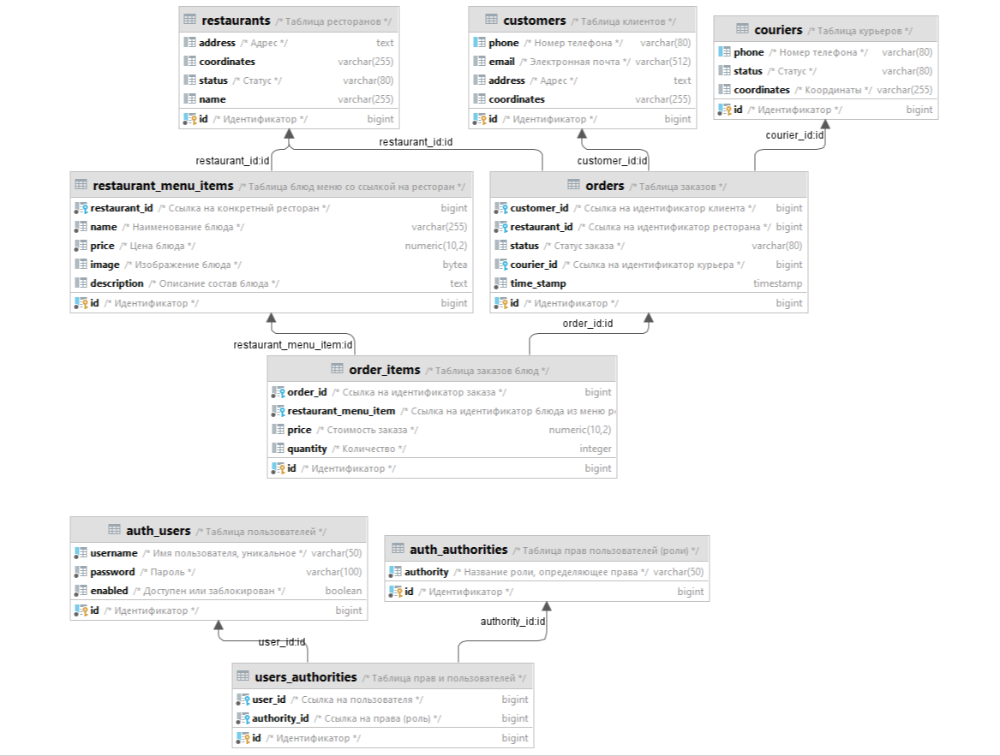

# food-service

## Запуск программы:
> **В папке docker** находятся два файла для двух вариантов запуска программы:
> * команда "docker-compose -f docker-compose.yaml up -d" запустит все 4 сервиса, rabbitmq, postgres и выполнит скрипты 
> миграции (**рекомендуется**) (необходимо находится в данной папке, для этого сделать cd docker)
> * команда "docker-compose -f rabbit-compose.yaml up -d" запустит только базу данных и rabbitmq, для корректной работы 
> программы нужно будет запустить скрипты миграции вручную командой "mvn -Plocal liquibase:update", 
> верные учетные данные для подключения к базе данных указаны в 
> migration/src/main/resources/db/local/liquibase.properties, после чего требуется вручную запустить все 4 сервиса 
> (сначала Kitchen Service). 
 
## Тестирование / Сценарий
> В папке postman коллекция из необходимых эндпоинтов для прохождения сценария от создания заказа до его выполнения, 
> плюс варианты для проверки других эндпоинтов (получение всех заказов, конкретного заказа, отмена заказа, отказ 
> курьером). 

> **Важно** необходимо добавить JWT токен в Authorizaiton header (Bearer), который нужно получить на пути 
> /login, где порт у каждого сервиса свой (указан в .properties). 
> * Пользователь courier для delivery-service (пароль courier)
> * Пользователь kitchen для kitchen-service (пароль kitchen)
> * Пользователь customer для order-service (создание заказа) (пароль customer)

## Order
> Модуль Order отвечает за обработку заказов. Здесь содержатся классы и методы, связанные с созданием, изменением и 
> отменой заказов.

## Notification
> Модуль Notification отвечает за отправку уведомлений. Здесь содержатся классы и методы, связанные с отправкой 
> уведомлений клиентам о состоянии и изменениях в заказах.

## Kitchen
>Модуль Kitchen отвечает за приготовление блюд. Здесь содержатся классы и методы, связанные с обработкой заказов и 
> подготовкой блюд в кухне.

## Delivery
> Модуль Delivery отвечает за доставку заказов. Здесь содержатся классы и методы, связанные с организацией доставки 
> заказов клиентам.

## dependency_bom
> Модуль dependency_bom содержит общие зависимости на сторонние библиотеки для всех модулей. Здесь указаны версии и 
> настройки зависимостей, необходимых для работы всех модулей репозитория. Это позволяет упростить управление 
> зависимостями и обеспечить единообразие в использовании библиотек во всех модулях репозитория.

## migration
> Модуль, содержащий скрипты миграции
> 

**В данном репозитории каждый модуль отвечает за свою часть функциональности системы заказов:** 
* создание заказа, 
* отправка уведомлений, 
* приготовление блюд и доставка.

## Диаграмма:
